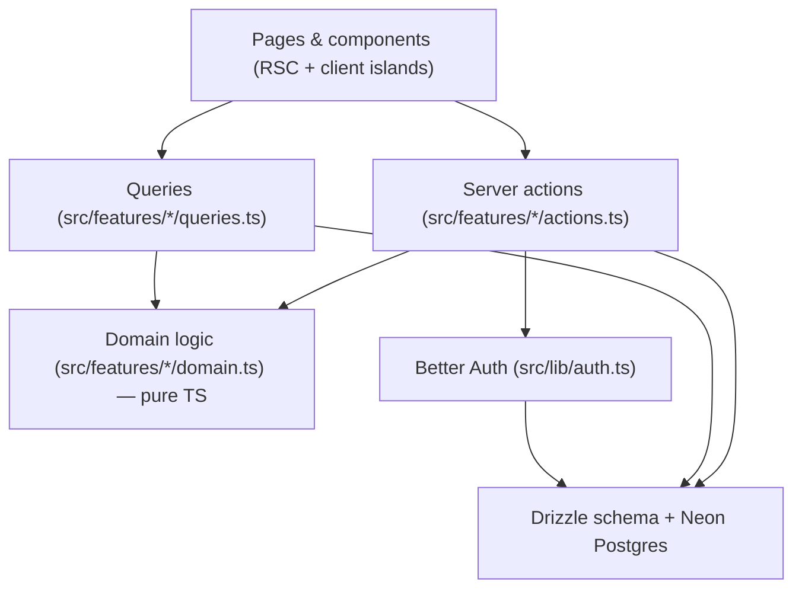

# Quest — Architecture Overview

The stack is lifted from CommuniFi so the two projects stay one context switch
apart: TypeScript everywhere, Next.js App Router on Vercel, Neon Postgres via
Drizzle, Better Auth, Tailwind + shadcn/ui.

## Layers



The rule that keeps this honest: **rows in, numbers out**. Queries return rows.
Turning rows into hours, splits and percentages happens in `domain.ts` files
that import nothing from the database or React — which is why the number the
Loom opens on can be reasoned about on its own.

## Directory map

```
src/
  app/                      routes only — each page reads, then renders
    (auth)/                 login + signup, redirects away if signed in
    (app)/                  the signed-in shell; every page below assumes a session
    api/auth/[...all]/      Better Auth handler
  components/               app-wide UI (shell, providers, primitives)
    ui/                     shadcn/ui components — generated, don't hand-edit
  db/
    index.ts                lazy Neon connection
    schema/                 one module per table, re-exported from index.ts
    seed.ts                 CLI seed (npm run db:seed)
  features/<feature>/
    domain.ts               pure logic, no db/React imports
    queries.ts              reads, "server-only"
    actions.ts              writes, "use server"
    validation.ts           zod schemas shared by forms and actions
    components/             feature UI
  hooks/                    shared client hooks
  lib/                      cross-cutting: auth, session, time, duration, colours
```

Features today: `quests`, `tasks`, `time-tracking`, `planning`, `insights`,
`auth`, `demo`, `settings`. A feature owns its vocabulary; anything two features
need moves to `src/lib`.

`planning` and `insights` are the same measurement pointed in opposite
directions: `planning/domain.ts` projects the quest/admin split from estimates
*before* the day, `insights/domain.ts` aggregates it from tracked time *after*.
Keeping them as separate pure modules is what lets the planning dialog
recompute its projection on every click without a round trip.

## Conventions that matter

**Session is the only source of a user id.** `requireUser()` (`src/lib/session.ts`)
is called in the shell layout and again in every action. No action accepts a
`userId` argument, and every query and write is scoped by it — an id guessed
from a URL updates nothing rather than someone else's row.

**Actions return, they don't throw.** Every action returns
`ActionResult<T>` (`src/lib/action.ts`). Client components call them through the
`useAction` hook, which handles pending state and error toasts in one place.

**Mutations revalidate the workspace as a unit.** Changing a task's quest moves
numbers on Today, Quests and Insights at once, so actions call
`revalidateWorkspace()` rather than each guessing which pages care.

**Derived data is never stored.** No split, percentage or per-quest total lives
in a column. Everything is a date-range aggregation over `time_entries`, which
is what makes the timeframe selector cheap.

**Stubs are labelled.** P2 features (social discovery, milestones, privacy
controls) are components with a `⚠️ STUB` header comment and hardcoded data, so
nobody mistakes them for shipped behaviour.

## Deliberate limits

- **No interactive transactions.** The Neon HTTP driver doesn't have them.
  Anything that must be atomic is expressed as a single statement or a database
  constraint — see the partial unique index enforcing one running timer per user.
- **No test framework yet.** The `domain.ts` files are written to be trivially
  testable when one is added; nothing else in the repo depends on that decision.
- **The day timeline is read-only.** PRODUCT_PLAN §3 judged drag-and-drop the
  most expensive interaction in the category and the least related to the
  product's claim. `DayTimeline` renders tracked time on a clock; dragging a
  task onto a slot would need a start-time column on `tasks`, which is where
  that decision should be re-opened, not in the component.
- **Tasks have an estimate but no time of day.** That is why the timeline shows
  what happened rather than what is scheduled.
