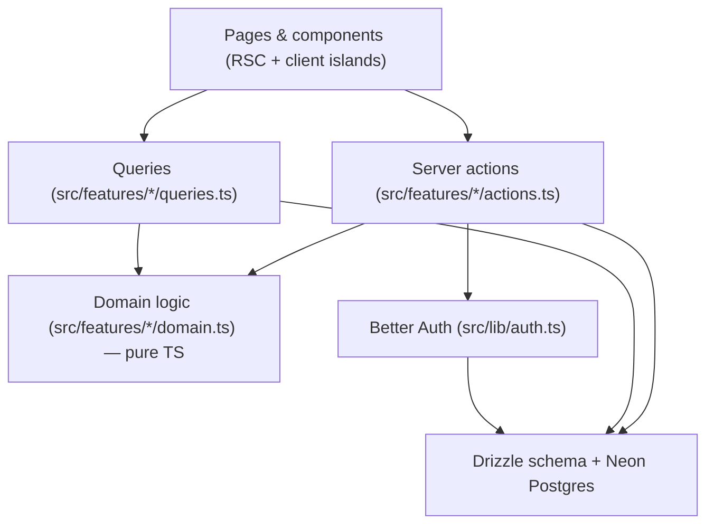

# Quest — Architecture Overview

The stack is lifted from CommuniFi so the two projects stay one context switch
apart: TypeScript everywhere, Next.js App Router on Vercel, Neon Postgres via
Drizzle, Better Auth, Tailwind + shadcn/ui.

## Layers



The rule that keeps this honest: **rows in, numbers out**. Queries return rows.
Turning rows into hours, splits and percentages happens in `domain.ts` files
that import nothing from the database or React — which is why the number the
Loom opens on can be reasoned about on its own.

## Directory map

```
src/
  app/                      routes only — each page reads, then renders
    (auth)/                 login + signup, redirects away if signed in
    (app)/                  the signed-in shell; every page below assumes a session
    api/auth/[...all]/      Better Auth handler
  components/               app-wide UI (shell, providers, primitives)
    ui/                     shadcn/ui components — generated, don't hand-edit
  db/
    index.ts                lazy Neon connection
    schema/                 one module per table, re-exported from index.ts
    seed.ts                 CLI seed (npm run db:seed)
  features/<feature>/
    domain.ts               pure logic, no db/React imports
    queries.ts              reads, "server-only"
    actions.ts              writes, "use server"
    validation.ts           zod schemas shared by forms and actions
    components/             feature UI
  hooks/                    shared client hooks
  lib/                      cross-cutting: auth, session, time, duration, colours
```

Features today: `quests`, `tasks`, `today`, `backlog`, `home`, `insights`,
`auth`, `demo`, `settings`. A feature owns its vocabulary; anything two features
need moves to `src/lib`.

`tasks/domain.ts` and `insights/domain.ts` are the same measurement pointed in
opposite directions: the first summarises a *day* from its estimates (what today
is for), the second aggregates a *window* from finished work (what actually
happened). Both are pure, both read the same two fields on a task — `PLANNED`
(`estimate_minutes`) and `ACTUAL` (`actual_minutes`, falling back to the
estimate). There is no timer and no time-entry table.

## Conventions that matter

**Session is the only source of a user id.** `requireUser()` (`src/lib/session.ts`)
is called in the shell layout and again in every action. No action accepts a
`userId` argument, and every query and write is scoped by it — an id guessed
from a URL updates nothing rather than someone else's row.

**Actions return, they don't throw.** Every action returns
`ActionResult<T>` (`src/lib/action.ts`). Client components call them through the
`useAction` hook, which handles pending state and error toasts in one place.

**Mutations revalidate the workspace as a unit.** Changing a task's quest moves
numbers on Home, the board, the backlog and Quests at once, so actions call
`revalidateWorkspace()` rather than each guessing which pages care.

**Derived data is never stored.** No split, percentage or per-quest total lives
in a column. Every number is an aggregation over `tasks` for a range of day
keys, which is what keeps a new cut of the data a pure function away.

**Stubs are labelled.** P2 features (social discovery, milestones, privacy
controls) are components with a `⚠️ STUB` header comment and hardcoded data, so
nobody mistakes them for shipped behaviour.

## Deliberate limits

- **No interactive transactions.** The Neon HTTP driver doesn't have them.
  Anything that must be atomic is expressed as a single statement or a database
  constraint. A drag writes destination and order in one `moveTask` action for
  the same reason: two round trips would let the board render a task in the
  right column at the wrong position.
- **No test framework yet.** The `domain.ts` files are written to be trivially
  testable when one is added; nothing else in the repo depends on that decision.
- **Tasks have a duration but no time of day.** The clock on a card is
  projected by `projectStarts()` from the column's order, starting at
  `DAY_START_MINUTE`. Nothing is stored, which is what makes reordering
  meaningful — and what keeps the list and the timeline rail from disagreeing.
  Real timeboxing would need a start-time column; that is where the decision
  should be re-opened, not in the component.
- **Drag is native HTML5, not a library.** It is the one interaction the
  category is known for, so it is built (day↔day, backlog buckets, reorder) —
  but every move is also reachable from the row's own schedule menu, because
  drag is mouse-only and a demo needs a path that can't miss.
